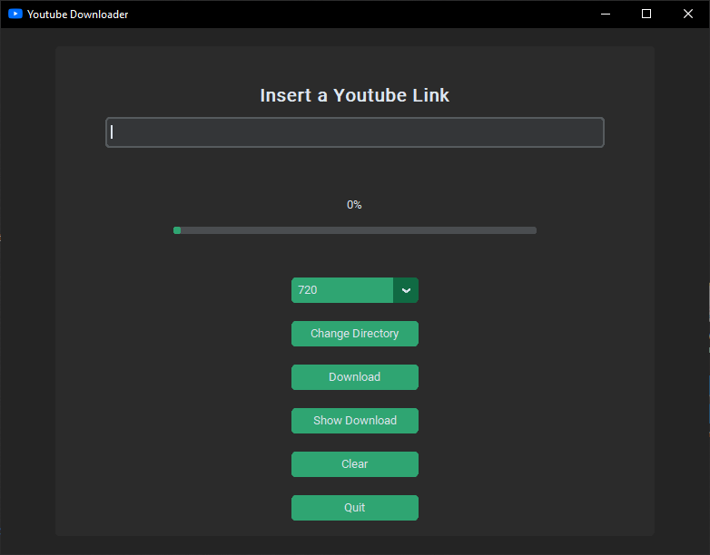

<div align = "center">
</img>
</div>

# **YouTube Downloader**

> **Simple & modern YouTube Downloader to download videos, playlists, subtitles and search queries.**

## Features

<ul>
<li>🔗 Download Videos by URL.</li>
<li>🔗 Download **Entire Playlist**.</li>
<li>🔉 Download audio only</li>
<li>🔖 Selectable qualities.</li>
<li>📂 Change the download path.</li>
<li>🌄 Simple & modern GUI.</li>
<li>⚙️ Auto Pastes Link from clipboard.</li>
<li>📂 Show Download location Button.</li>
</ul>

## Screenshots

<dl>
<figure>
</img>
<figcaption>| Video Downloader Page</figcaption>
</figure>
</dl>

## Installation Guide

### **For Windows:**

Download the exe from the latest <a href = "https://github.com/Dev7083/YouTube-Downloader/releases">release</a>, or install it from the source code:

<ol>
<li>Install <a href = "https://www.python.org/downloads/">python</a> .</li>

<!-- <li>Download <a href = "https://ffmpeg.org/download.html">ffmpeg</a> and add it to the path or put ffmpeg.exe in the same folder as the script</li> -->

<li>Clone this repo using <a href = "https://git-scm.com/downloads">git</a> & change directory</li>

```
git clone https://github.com/Dev7083/YouTube-Downloader.git

cd YouTube-Downloader
```

<li>Install required modules using pip</li>

```
pip install -r requirements.txt
```

<li>Run the youtube.py file!</li>

```
py youtube.py
```

## Tech Stack

**UI:** CustomTkinter

**Libraries:** PytubeFix
